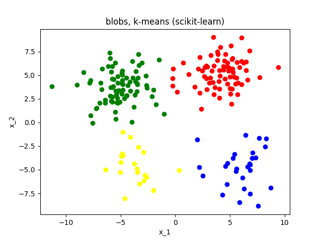
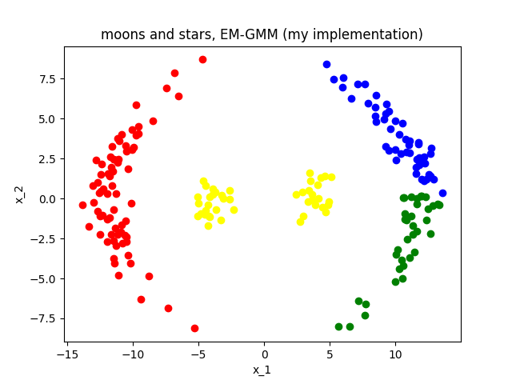

# Clustering Algorithm Implementation and Visualization from Scratch with Python

## Overview

This project implements four popular clustering algorithms from scratch in Python, designed to work for datasets with `d >= 2` dimensions and `k >= 2` clusters. The implementations are tested on 2D datasets and compared visually with scikit-learn's implementations to evaluate correctness and performance.

### **Implemented Clustering Algorithms**
1. **K-Means Clustering**  
2. **Gaussian Mixture Model (GMM) using Expectation-Maximization (EM)**  
3. **Mean-Shift Clustering**  
4. **Agglomerative Clustering**

---

## Python Implementations

- **`KMeans.py`**: Implementation of the K-Means clustering algorithm.  
- **`KMeans_Ver0.py`**: A functional version of K-Means with modular methods.  
- **`GaussianMM.py`**: Implementation of GMM using EM.  
- **`GaussianMM_Ver0.py`**: An extended version with AIC, BIC, and prediction functions.  
- **`MeanShift.py`**: Implementation of Mean-Shift clustering.  
- **`Agglomerative.py`**: Implementation of Agglomerative clustering.

---

## Evaluations and Tests

- **`test_2d_visualization.py`**:  
  Tests each implementation on 2D datasets with visualization, comparing the results to scikit-learn's equivalent algorithms.  
- **`data_2d_test/`**:  
  Contains the datasets used for testing.  
- **`test_2d_visualization_results/`**:  
  Stores the output images of the clustering results.

---

## Visualization Results

### **Blobs Dataset**

| **Algorithm**       | **My Implementation**                                                                                     | **Scikit-learn**                                                                                     |
|----------------------|-----------------------------------------------------------------------------------------------------------|------------------------------------------------------------------------------------------------------|
| **Agglomerative**    |            |            |
| **EM-GMM**           |                  |                  |
| **K-Means**          |                 |                 |
| **Mean-Shift**       |              |  |

---

### **Moons and Stars Dataset**

| **Algorithm**       | **My Implementation**                                                                                     | **Scikit-learn**                                                                                     |
|----------------------|-----------------------------------------------------------------------------------------------------------|------------------------------------------------------------------------------------------------------|
| **Agglomerative**    |  |  |
| **EM-GMM**           |        |        |
| **K-Means**          |       |       |
| **Mean-Shift**       |    |  |

---

### **Sticks Dataset**

| **Algorithm**       | **My Implementation**                                                                                     | **Scikit-learn**                                                                                     |
|----------------------|-----------------------------------------------------------------------------------------------------------|------------------------------------------------------------------------------------------------------|
| **Agglomerative**    |           |           |
| **EM-GMM**           |                 |                 |
| **K-Means**          |                |                |
| **Mean-Shift**       |             |  |
