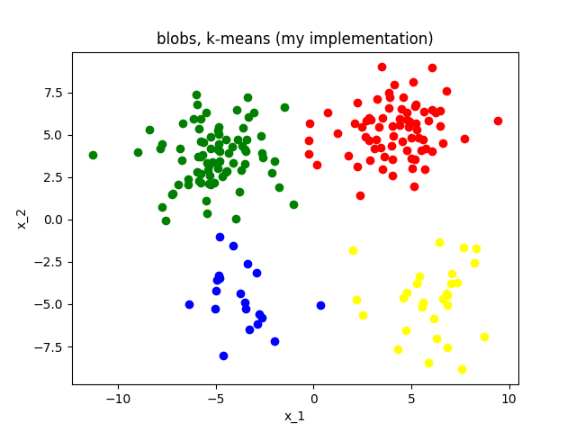
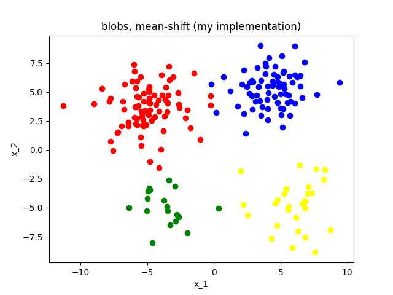

# Clustering algorithm implementaion and visualization from scratch with python

## Four popular clustering algorithms (for d >= 2 dimensions, k >= 2 clusters):  
- (1) k-means clustering  
- (2) Gaussian mixture model - expectation maximization algorithm (EM-GMM)  
- (3) mean-shift clustering   
- (4) agglomerative clustering 

## Python implementations:  
- `KMeans.py`: k-means clustering  
- `KMeans_Ver0.py`: second version of k-means implementation as a function  
- `GaussianMM.py`: EM-GMM
- `GaussianMM_Ver0.py`: second version of EM-GMM implementation with functions of AIC, BIC and predict  
- `MeanShift.py`: mean-shift clustering
- `Agglomerative`: agglomerative clustering

## Evaluations and tests:  
- `test_2d_visualization.py`: tests on 2D datasets with visualization, compared with sklearn implementation  
- `data_2d_test folder`: datasets for tests  
- `test_2d_visualization_results folder`: output images of tests  

## Visualization Results

The following figures compare the clustering results of my own implementations with those of scikit-learn's implementations. Each dataset is processed using different clustering algorithms.

---

### Blobs Dataset

| **Algorithm**       | **My Implementation**                                                                 | **Scikit-learn**                                                                 |
|----------------------|---------------------------------------------------------------------------------------|----------------------------------------------------------------------------------|
| **Agglomerative**    |  |  |
| **EM-GMM**           |                |                |
| **K-Means**          |              |              |
| **Mean-Shift**       |        |  |

---

### Moons and Stars Dataset

| **Algorithm**       | **My Implementation**                                                                 | **Scikit-learn**                                                                 |
|----------------------|---------------------------------------------------------------------------------------|----------------------------------------------------------------------------------|
| **Agglomerative**    |  |  |
| **EM-GMM**           |                |                |
| **K-Means**          |              |              |
| **Mean-Shift**       |        |  |

---

### Sticks Dataset

| **Algorithm**       | **My Implementation**                                                                 | **Scikit-learn**                                                                 |
|----------------------|---------------------------------------------------------------------------------------|----------------------------------------------------------------------------------|
| **Agglomerative**    |  |  |
| **EM-GMM**           |                |                |
| **K-Means**          |              |              |
| **Mean-Shift**       |        |  |

---
